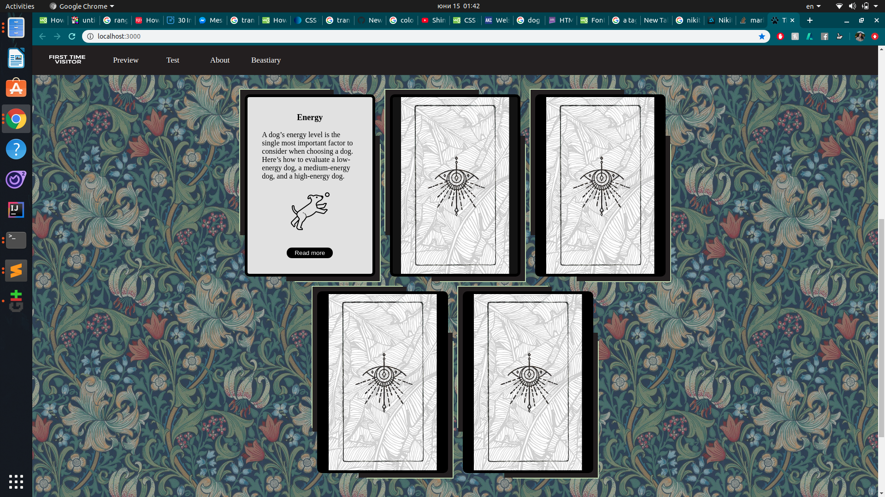

# TheDogBeastiary
  A website design inspired by AKC and Nikita Orlov's warrior dogs artworks. 
  The site provides information about different dog breeds and a test to determine which breed is the best for the current user.
  The design was inspired by medieval color pallets and tapestries.
  [Nikita Orlov's artwork](https://nikita.artstation.com/albums/1768395)
  
  [GITHUB PAGES PREVIEW]()
  
  Screenshots:
  
  
  
  
  
  
